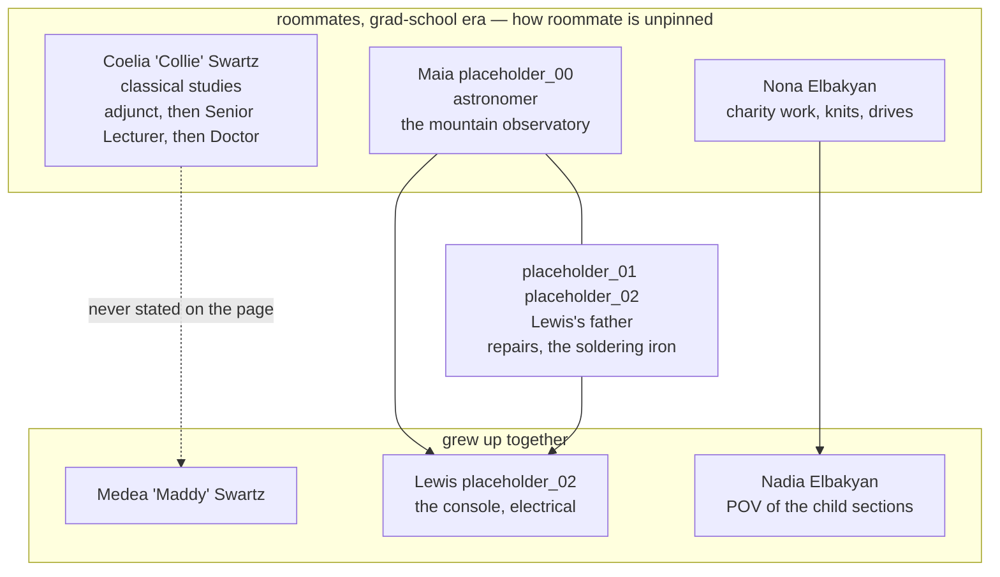

# Pedigree — chapter one

*Kin among the chapter one cast only. Authoritative for names and relations; see `the-academy-brainstorm.md` for the setting.*

## How to read it

| Edge | Means |
|---|---|
| **Solid arrow** | Parentage **stated in the prose** |
| **Dashed labelled arrow** | Parentage established, but **never written on the page** |
| **Solid line, no arrow** | Marriage |
| **Dotted, circle-ended** | Between the women: they were **roommates** in the grad-school era. Between the children: they grew up together |

The three women shared a flat before any of the children. That tie is **historical, not current** — by chapter one they are three households, and Maia's moving into Collie's in the last paragraph is a *re*convergence. **How roommate they were is deliberately unpinned** and the chart does not resolve it.

## The one relation the prose never states

**Collie is never identified as Maddy's mother.** ¶17 gives you *"Maddy's mom is someone who is very smart, and works at the university"* and, separately, *"Auntie Collie is a nice woman … she kisses them both."* The reader infers it; nobody says it.

That is defensible and possibly better than saying it — a child holds *Maddy's mom* and *Auntie Collie* as two facts about one person, and the section is in Nadia's POV. But **the line the whole book runs through is its least-stated relation**, so it should be a choice rather than an oversight.

## Placeholders

Numbered so each unknown is tracked separately and greppable.

| Token | Slot | Note |
|---|---|---|
| `[placeholder_00]` | Maia's surname | May turn out to equal `[placeholder_02]`, if she took her husband's |
| `[placeholder_01]` | The husband's **given** name | He has none at all. He is the one who takes the controller apart and puts a soldering iron to the loose motor wire, and the maxim about testing before you close the shell is what survives him |
| `[placeholder_02]` | Lewis's surname | **Not** automatically *Latimer*. That reference supplies his *given* name — Lewis Latimer made the carbon filament practical and is credited for none of it |

Rendered bare inside the mermaid block because square brackets break the parser inside node labels.

## Naming, for consistency

The adults carry classical names that read as graduate-school nicknames which hardened — **Coelia** is a Roman *gens* name and the last Vestalis Maxima, **Maia** the eldest Pleiad and Greek for midwife, **Nona** the Parca who spins. The children split: **Medea** stays in that register (from *mēdomai*, to plan; the *med-* root of *medicine*; granddaughter of Helios), while **Nadia Elbakyan** and **Lewis** carry the corrective device — named for people the old world took from and did not credit.

Every one of them goes by something a neighbour could shout across a park. The grand register is entirely on the paperwork.

## Out of scope

Chapter one characters who are not kin, listed so the chart's completeness is auditable:

- **The clinic doctor** — ¶51–71, male, unnamed. Shakes Collie's hand at the end of the negotiation.
- **The food bank director** — ¶9, unnamed, in the next slot on the video.
- **The messenger** who fetches Collie — ¶33–47, unnamed, ungendered.
- **The butch rendezvous** who installed the break room AC — ¶3, unnamed, ungendered.
